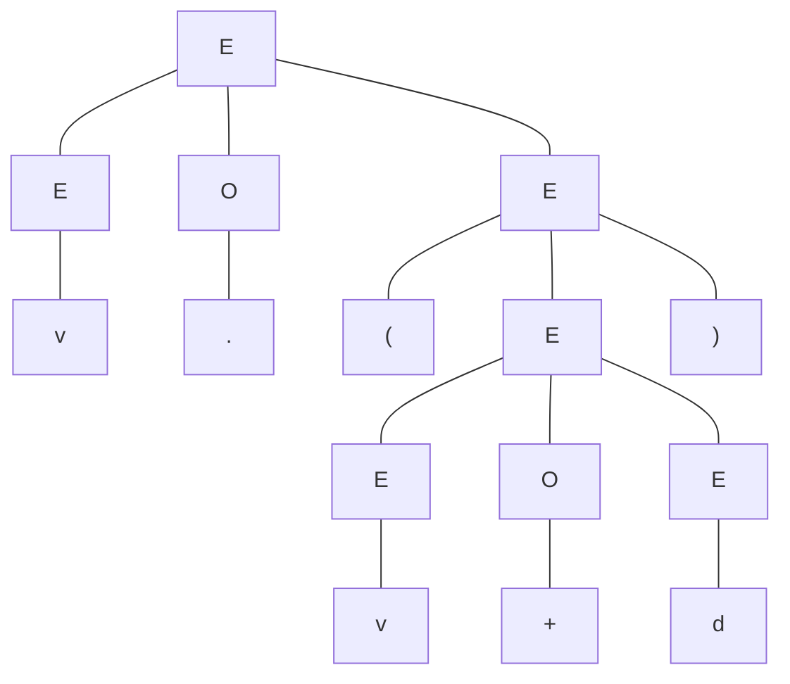
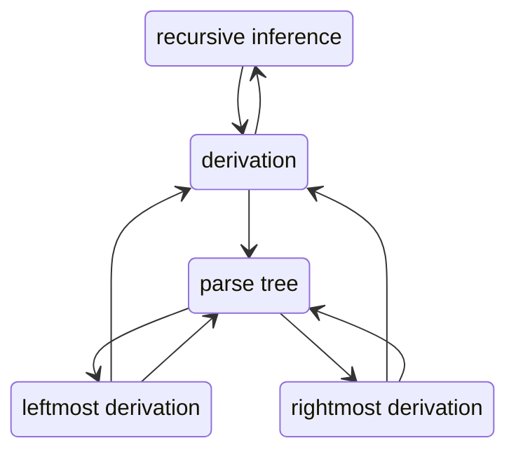

---  
tags:  
  - math  
  - FLA  
categories:  
  - Formal Language & Automata  
share: true  
lev: 3  
---  
  
  
# Table of Contents  
  
- [[Context-Free Grammar#Definition of Context-Free Grammars|Definition of Context-Free Grammars]]  
	- [[Context-Free Grammar#Definition of Context-Free Grammars|Four components of  grammars:]]  
	- [[Context-Free Grammar#Definition of Context-Free Grammars|Formal definition of context-free grammar:]]  
- [[Context-Free Grammar#Derivation Using a Grammar|Derivation Using a Grammar]]  
	- [[Context-Free Grammar#Derivation Using a Grammar|Recursive inference and derivation:]]  
		- [[Context-Free Grammar#Recursive inference and derivation:|1.Recursive inference:]]  
		- [[Context-Free Grammar#Recursive inference and derivation:|2.Derivation:]]  
	- [[Context-Free Grammar#Derivation Using a Grammar|Derivation relation:]]  
	- [[Context-Free Grammar#Derivation Using a Grammar|Leftmost and rightmost derivation:]]  
		- [[Context-Free Grammar#Leftmost and rightmost derivation:|1. Leftmost derivation:]]  
		- [[Context-Free Grammar#Leftmost and rightmost derivation:|2. Rightmost derivation:]]  
- [[Context-Free Grammar#Context-Free Language|Context-Free Language]]  
	- [[Context-Free Grammar#Context-Free Language|Sentential forms:]]  
	- [[Context-Free Grammar#Context-Free Language|Language of Context-Free Grammar:]]  
	- [[Context-Free Grammar#Context-Free Language|How to prove that a given language is the language of some grammar?]]  
- [[Context-Free Grammar#Parse Trees|Parse Trees]]  
	- [[Context-Free Grammar#Parse Trees|Definition:]]  
	- [[Context-Free Grammar#Parse Trees|The yield of a parse tree:]]  
	- [[Context-Free Grammar#Parse Trees|Inference, derivation, and parse tree:]]  
		- [[Context-Free Grammar#Inference, derivation, and parse tree:|Comment]]  
		- [[Context-Free Grammar#Inference, derivation, and parse tree:|Derivation to parse tree]]  
- [[Context-Free Grammar#Ambiguity|Ambiguity]]  
	- [[Context-Free Grammar#Ambiguity|Definition]]  
	- [[Context-Free Grammar#Ambiguity|Leftmost derivation & parse tree]]  
		- [[Context-Free Grammar#Leftmost derivation & parse tree|Parse tree gives a leftmost derivation]]  
			- [[Context-Free Grammar#Parse tree gives a leftmost derivation|Lemma 1]]  
			- [[Context-Free Grammar#Parse tree gives a leftmost derivation|Proof]]  
		- [[Context-Free Grammar#Leftmost derivation & parse tree|Injection]]  
		- [[Context-Free Grammar#Leftmost derivation & parse tree|Surjection]]  
	- [[Context-Free Grammar#Ambiguity|Inherent ambiguity]]  
		- [[Context-Free Grammar#Inherent ambiguity|Priority of operations]]  
		- [[Context-Free Grammar#Inherent ambiguity|Associativity of operations]]  
		- [[Context-Free Grammar#Inherent ambiguity|if and else]]  
  
  
# Context-Free Grammar  
  
## Definition of Context-Free Grammars  
  
### Four components of  grammars:  
  
1. **The set of terminals**: An finite set of symbols which serves as alphabet.  
2. **The set of variables (or nonterminals, syntactic categories):** Each variable represents a set of strings, usually in uppercase.  
3. **Start symbol**: A special variable,  which represents the language being defined.  
4. **The set of productions (or rules)**: A finite set of rules that represent the recursive definition of a language. Each production looks like $head \rightarrow body$.   
  
### Formal definition of context-free grammar:  
  
> [!definition]  
> A ***context-free grammar*** (***CFG***) is a 4-tuple $G=(V,T,P,S)$, which satisfies:  
>   
>$$  
> \begin{gather*}  
> V\cap T=\emptyset,S\in V,\\  
> P\subseteq\{A\rightarrow \alpha|A\in V,\alpha \in (V\cup T)^*\}  
> \end{gather*}  
> $$  
>   
  
The first two rules describe set of terminals, set of variables and start symbol. The last one requires all productions in $P$ to be in a specific form. Here are two examples of CFG:  
  
1. CFG $G_{01}=({S},{0,1},P,S)$, where elements of $P$ are:  
   - $S\rightarrow 01$  
   - $S\rightarrow 0S1$  
2. CFG $G_{exp}=(\{E,O\},\{(,),+,\cdot,v,d\},P,E)$, and $P$ contains exactly:  
   - $E\rightarrow EOE$  
   - $E\rightarrow (E)$  
   - $E\rightarrow v$  
   - $E\rightarrow d$  
   - $O\rightarrow +$  
   - $O\rightarrow \cdot$  
  
**A compact notion for productions:**  
  
Writing $A\rightarrow \alpha_1|\alpha_2|\cdots|\alpha_n$ in place of $A\rightarrow \alpha_1$, $A\rightarrow\alpha_2$, $\ldots$ , $A\rightarrow\alpha_n$ for convenience.  
  
## Derivation Using a Grammar  
  
### Recursive inference and derivation:  
  
There are two approaches to infer if certain strings are in the language of a certain **variable**.  
  
#### 1.Recursive inference:  
  
Reducing the given string to a variable by applying productions from body to head.  
  
- For CFG $G_{exp}$ (defined above), and string $v\cdot(v+d)$:  
  
  $v\cdot(v+d)\implies v\cdot(v+E)\implies vO(v+E)\implies\cdots\implies EO(EOE)\implies EO(E)\implies EOE\implies E$  
  
#### 2.Derivation:  
  
Expanding variable into the string by applying productions from head to body.  
  
- For CFG $G_{exp}$ (defined above), and string $v\cdot(v+d)$:  
  
  $E\implies EOE\implies EO(E)\implies EO(EOE)\implies vO(EOE)\cdots\implies v\cdot(v+d)$  
  
*PS: Actually we need to prove that the two approaches are equivalent.*  
  
### Derivation relation:  
  
We define a relation $\underset{G}{\Rightarrow}$ on $(V\cup T)^*$ to denote **derivation**. If $\alpha,\beta\in(V\cup T)^*$ and $A\rightarrow \gamma\in P$, then $\alpha A\beta \underset{G}{\Rightarrow}\alpha\gamma\beta$. If $G$ is understood, then we simply write $\alpha A\beta \Rightarrow\alpha\gamma\beta$.   
  
We can extend this relation to its reflexive transitive closure $\overset{*}{\underset{G}{\Rightarrow}}$, which can be formally defined as:  
  
> $$\forall \alpha\in(V\cup T)^*,\enspace \alpha\overset{*}{\underset{G}{\Rightarrow}}\alpha$$  
>  
> $$\enspace \alpha\overset{*}{\underset{G}{\Rightarrow}}\beta,\enspace \beta\underset{G}{\Rightarrow}\gamma\implies \alpha\overset{*}{\underset{G}{\Rightarrow}}\gamma$$  
>  
  
### Leftmost and rightmost derivation:  
  
To restrict the number of choices we have in deriving a string, we define two derivation methods.   
  
Examples are both for $G_{exp}$.  
  
#### 1. Leftmost derivation:  
  
Replace the leftmost variable by one of its production body in each derivation step.  
  
Symbol: $\underset{lm}{\Rightarrow}$ and $\overset{*}{\underset{lm}{\Rightarrow}}$, eg.  
  
$E\underset{lm}{\Rightarrow} EOE\underset{lm}{\Rightarrow} vOE\underset{lm}{\Rightarrow} v\cdot E\underset{lm}{\Rightarrow} v\cdot(E)\underset{lm}{\Rightarrow} v\cdot(EOE)\underset{lm}{\Rightarrow} v\cdot(vOE)\overset{*}{\underset{lm}{\Rightarrow}} v\cdot(v+d)$  
  
#### 2. Rightmost derivation:  
  
Replace the rightmost variable by one of its production body in each derivation step.  
  
Symbol: $\underset{rm}{\Rightarrow}$ and $\overset{*}{\underset{rm}{\Rightarrow}}$, eg.  
  
$E\underset{rm}{\Rightarrow} EOE\underset{rm}{\Rightarrow} EO(E)\underset{rm}{\Rightarrow} EO(EOE)\underset{rm}{\Rightarrow} EO(EOd)\overset{*}{\underset{rm}{\Rightarrow}} v\cdot(v+d)$  
  
## Context-Free Language  
  
### Sentential forms:  
  
> Set CFG $G=(V,T,P,S)$, $\alpha\in(V\cup T)^*$ is a ***sentential form*** of $G$ iff $S\overset{*}{\Rightarrow}\alpha$.  
>  
> - If $S\overset{*}{\underset{lm}{\Rightarrow}}\alpha$, then $\alpha$ is a ***left-sentential form***.  
> - If $S\overset{*}{\underset{rm}{\Rightarrow}}\alpha$, then $\alpha$ is a ***right-sentential form***.  
> - If sentential form $\alpha\in T^*$, then $\alpha$ is a ***sentence***.  
>  
  
### Language of Context-Free Grammar:  
  
> For CFG $G=(V,T,P,S)$, the ***language*** of $G$, denoted $L(G)$, is defined as:  
>  
> $$L(G)=\{w|w\in T^*\land S\overset{*}{\underset{G}{\Rightarrow}}w\}$$  
>  
  
$L(G)$ is the set of all sentences of $G$.  
  
If a language $L$ is the language of some context-free grammar $G$, ie. $L=L(G)$, then $L$ is a ***context-free language*** (***CFL***).  
  
### How to prove that a given language is the language of some grammar?  
  
That is to prove $L=L(G)$, we usually prove containment in both ways:  
  
- $w\in L\implies w\in L(G)$  
- $w\in L(G)\implies w\in L$  
  
For the former, we usually do induction on $|w|$.  
  
For the latter, we usually do induction on the number of steps of derivation to $w$.  
  
## Parse Trees  
  
### Definition:  
  
For CFG $G_{exp}$ and $v\cdot(v+d)$, both derivation and recursive inference are constructing a tree:  
  

  
> For CFG $G=(V,T,P,S)$, a ***parse tree*** is a tree that satisfies the following conditions:  
>  
> 1. Each interior node is labeled by a variable in $V$.  
>  
> 2. Each leaf is labeled by either a variable, a terminal, or $\epsilon$. If the leaf is labeled $\epsilon$, it must be the only child of its parent.  
>  
> 3. If an interior node is labeled $A$, and its children are labeled   
>  
>    $$X_1,X_2,\ldots,X_k$$  
>  
>    respectively, from the left, then $A\rightarrow X_1X_2\cdots X_k$ is a production in $P$.   
>  
>    Note that the only time that some $X_i$ can be $\epsilon$ is if that is the label of the only child, and $A\rightarrow\epsilon$ is in $P$ .  
>  
  
### The yield of a parse tree:  
  
Concatenate all leaves of a parse tree from the left, we get a string in $(V\cup T)^*$, called the ***yield*** of the tree. Of importance are those parse trees such that:  
  
1. The yield is a terminal string.  
2. The root is labeled by start symbol.  
  
### Inference, derivation, and parse tree:  
  
> **Theorem**  
>   
> For CFG $G=(V,T,P,S)$, the following are equivalent:  
>  
> 1. The recursive inference procedure determines that terminal string $w$ is in the language of variable $A$.  
> 2. $A\overset{*}{\Rightarrow}w$.  
> 3. $A\overset{*}{\underset{lm}{\Rightarrow}}w$.  
> 4. $A\overset{*}{\underset{rm}{\Rightarrow}}w$.  
> 5. There is a parse tree with root $A$ and yield $w$.  
>  
  
#### Comment  
  
Actually this theorem is not accurate. For example, we can actually feel that if we reverse a derivation, we get a recursive inference procedure.  
  
The textbook doesn't give a formal definition of recursive inference, and I think the reason why it doesn't show that is that recursive inference is merely the inverse of derivation. But I'm not pleased that the book discusses proof about recursive inference without giving a formal definition of it! And actually what the book does about this part is equivalent to this proposition:  
  
**Proposition 1**  
  
> Set $X=X_1X_2\cdots X_k\in(V\cup T)^*$, $w\in T^*$, if $X\overset{*}{\Rightarrow}w$, then $\exists w_1,w_2,\cdots,w_k$ that:  
>  
> - $w=w_1w_2\cdots w_k$.  
> - For $i\in\{1,2,\ldots,k\}$, $X_i\begin{cases}=w_i,&X_i\in T,\\ \overset{*}{\Rightarrow} w_i,&X_i\in V,\end{cases}$  
  
which is easy to prove by induction.  
  
Also, actually a parse tree is in correspondence to a unique leftmost derivation (or to a rightmost derivation). This is an important proposition in the discussion of ambiguity in grammars, which will be proved in next section.  
  
Our proof would be like:  
  

  
Both-side arrows between two means bijection.  
  
So, what's left is just derivation to a parse tree. Here's the proof:  
  
#### Derivation to parse tree  
  
First, for convenience, we shall extend $w$ into any sentence in $(V\cup T)^*$.  
  
Induction on steps of derivation $n$ to $w$ :  
  
1. $n=1$, i.e., there are production $A\rightarrow w$. There are a parse tree that just looks like this.  
2. Suppose there are a parse tree corresponding to every derivation of steps at most $n$. Consider the last step of a derivation to $w$ that has $n+1$ steps ($\alpha X\beta\Rightarrow \alpha\gamma\beta=w$). We know that there are a parse tree corresponding to $A\overset{*}{\Rightarrow} \alpha X\beta$ which yields $\alpha X\beta$. Consider extending the tree by adding letters of $\gamma$ to leaf node $X$. It's the same to prove by induction that the result is also a parse tree, and it yields $\alpha\gamma\beta$ that is exactly $w$.  
  
By the way, in the process we can also prove that:  
  
> Each step of derivation corresponds to an interior node (or root) in the parse tree.   
>  
> The steps taken to derive an intermediate sentence $X$ equals to the length of shortest path from root to the children of the interior node the derivation corresponds to.  
  
## Ambiguity  
  
### Definition  
  
>  A CFG $G=(V,T,P,S)$ is *ambiguous* if and only if $\exists w\in T^*$, there are two different parse trees that have root $S$ and yield $w$.  
  
Unfortunately, given any CFG, telling whether it's ambiguous is undecidable. But we have a equivalent definition for ambiguity:  
  
>  A CFG $G=(V,T,P,S)$ is *ambiguous* if and only if $\exists\:w\in T^*$, there are two different leftmost (or rightmost) derivations that show $w$ is in the language of $S$.  
  
This was mentioned before, it's equivalent to proving that there are a bijection between the set of parse trees and the set of leftmost (rightmost) derivations. Now we prove it for leftmost derivation:  
  
### Leftmost derivation & parse tree  
  
We first prove that each parse tree gives a leftmost derivation.  
  
#### Parse tree gives a leftmost derivation  
  
We can't expand this to $(V\cup T)^*$ because there may be $w\in(V\cup T)^*$ that satisfies $S\overset{*}{\Rightarrow}w$ but there are no leftmost derivation from $S$ to $w$. So we need to change a little bit in our way of induction. Let's first prove a lemma:  
  
##### Lemma 1  
  
> Set $X=X_1X_2\cdots X_k\in(V\cup T)^*$, $w=w_1w_2\cdots w_k\in T^*$,   
>  
> -  If $\forall i\in\{1,2,\ldots,k\}$, $X_i\overset{*}{\underset{lm}{\Rightarrow}}w_i$ or $X_i=w_i$, then $X\overset{*}{\underset{lm}{\Rightarrow}}w$.  
  
***proof:***  
  
Set $Y_i=w_1w_2\cdots w_iX_{i+1}X_{i+2}\cdots X_k$, and $Y_0=X$, $Y_k=w$, we can show that $\forall i\in\{1,2,\ldots,k\}$, $Y_{i-1}\underset{lm}{\Rightarrow}Y_i$. Thus by easy induction lemma 1 is proved.   
  
Q.E.D. lemma 1.  
  
##### Proof  
  
Then we can do induction on the height $h$ of the parse tree.  
  
1. $h=1$, trivial;  
  
2. From $h=n$ to $h=n+1$:  
  
   Assume that the root $A$ directly connect $X_1,X_2,\ldots,X_k$, which means applying production $A\rightarrow X_1X_2\cdots X_k$. Proposition 1 and inductive basis tell us that there are corresponding $X_i\overset{*}{\underset{lm}{\Rightarrow}}w_i$. Lemma 1 provides a way to construct $X\overset{*}{\underset{lm}{\Rightarrow}}w$, together with $A\underset{lm}{\Rightarrow}X$, we know that there is a corresponding leftmost derivation.  
  
Q.E.D. parse tree to leftmost derivation.  
  
#### Injection  
  
We have just proved that every parse tree gives a leftmost derivation. Actually the induction can be viewed as a recursive method constructing a corresponding leftmost derivation:  
  
1. If $h=1$, trivial;  
  
2. If $h>1$, then $A\underset{lm}{\Rightarrow}X=X_1X_2\cdots X_k\overset{*}{\underset{lm}{\Rightarrow}}w_1X_2\cdots X_k\overset{*}{\underset{lm}{\Rightarrow}}\cdots\overset{*}{\underset{lm}{\Rightarrow}}w_1w_2\cdots w_k=w$. Apart from the first step, all other steps are constructed by recursion.  
  
We can now prove that different parse trees must give different leftmost derivation with this method. The detailed proof is simply induction similar to above.  
  
Q.E.D. injection.  
  
#### Surjection  
  
Now we need to prove for surjection. The idea is the same, we now do induction on the number of steps in the derivation. The detailed proof is again similar.  
  
Q.E.D. surjection.  
  
### Inherent ambiguity  
  
A CFL $L$ is said to be ***inherently ambiguous*** if all its grammars are ambiguous.  
  
Whether a CFL is ambiguous or not is not determinable.   
  
However, usually we prefer unambiguous grammars, so we try to construct unambiguous grammar for given language. The course gave some examples of eliminating ambiguity in certain grammars.  
  
#### Priority of operations  
  
For CFG $G_{exp}$ given in last lecture note:  
  
- $E\rightarrow EOE|(E)|v|d$.  
- $O\rightarrow +|\times$.  
  
For string $v+v\times d$, there are two different leftmost derivations:  
  
- $E\Rightarrow EOE\overset{*}{\Rightarrow} v+E\Rightarrow v+EOE\overset{*}{\Rightarrow}v+v\times d$.  
- $E\Rightarrow EOE\Rightarrow EOEOE\overset{*}{\Rightarrow}v+v\times d$.  
  
If you draw the parse tree, you will find out that the first one does multiplication prior to addition while the other does addition prior to multiplication.  
  
We can design a grammar to do multiplication first as in practice:  
  
- $E\rightarrow E+E|T$.  
- $T\rightarrow T\times T|(E)|v|d$.  
  
#### Associativity of operations  
  
Having priority of different operations is not enough, for example, $v+v+d$ has two different leftmost derivations:  
  
- $E\Rightarrow E+E\Rightarrow E+E+E\overset{*}{\Rightarrow}v+v+d$.  
- $E\Rightarrow E+E\Rightarrow v+E\Rightarrow v+E+E\overset{*}{\Rightarrow}v+v+d$.  
  
We now introduce left-associativity:  
  
- $E\rightarrow E+T|T$.  
- $T\rightarrow T\times F|F$.  
- $F\rightarrow (E)|v|d$.  
  
This guarantees that we do left addition or multiplication first when there are consecutive additions or multiplications.  
  
#### if and else  
  
We can design a simple grammar for if-else sentence structure:  
  
- $S\rightarrow \epsilon|iS|iSeS$.  
  
But for $iie$, there are two different leftmost derivations:  
  
- $S\Rightarrow iSeS\Rightarrow iiSeS\overset{*}{\Rightarrow}iie$.  
- $S\Rightarrow iS\Rightarrow iiSeS\overset{*}{\Rightarrow}iie$.  
  
This is called *dangling else ambiguity*. It can be solved by matching each $else$ with the nearest $if$, and considering $else$ from left to right.  
  
- $S\rightarrow \epsilon|iS|iMeS$.  
- $M\rightarrow \epsilon|iMeM$.  
  
---  
Ahead:  
- [[Regular Expr&Lang|Regular Expr&Lang]]