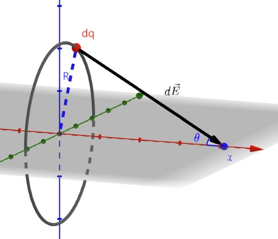
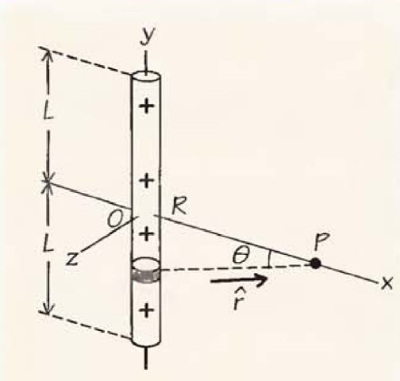
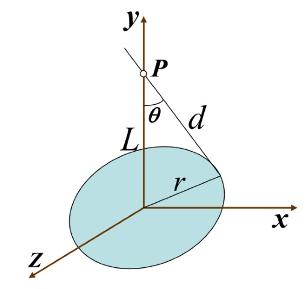

---  
tags:  
  - physics  
  - electromagnetism  
lev: 4  
categories:  
  - University Physics  
  - Electromagnetism  
share: "true"  
---  
  
# Table of Contents  
  
- [[Ex of E-field Calculations#Point charge|Point charge]]  
- [[Ex of E-field Calculations#Uniformly charged ring|Uniformly charged ring]]  
- [[Ex of E-field Calculations#Uniformly charged rod|Uniformly charged rod]]  
- [[Ex of E-field Calculations#Uniform circular sheet|Uniform circular sheet]]  
  
# Ex of E-field Calculations  
  
## Point charge  
  
You can directly write:  
  
$$  
\vec{E}(\vec{r})=\frac{1}{4\pi\varepsilon_{0}}\frac{q}{r^{2}}\hat{r}.  
$$  
  
You can also view this as a special charge distribution using *Dirac delta function* $\delta$, which is a *generalized function*. It satisfies the following condition for any *good function* $f$:  
  
$$  
\int\delta(\vec{x}-\vec{x}_0)f(\vec{x})d\vec{x}=f(\vec{x}_0).  
$$  
  
A point charge at $\vec{r}_i$ has a charge distribution $dq=q_i\delta(\vec{r}-\vec{r}_i)d\vec{r}$, thus:  
  
$$  
\vec{E}({\vec{r}_0})=\frac{1}{4\pi\varepsilon_{0}}\int\frac{dq}{r'^{2}}\hat{r}'=\frac{1}{4\pi\varepsilon_{0}}\frac{q}{||\vec{r}_0-\vec{r}_i||^{2}}\hat{r}'.  
$$  
  
Where $\vec{r}'=\vec{r}_0-\vec{r}$, which is consistent to calculation of discrete charge distribution.  
  
## Uniformly charged ring  
  
  
  
Suppose there is a uniformly charged ring of radius $R$ with total charge $Q$ fitting $y^2+z^2=R^2$, what is the e-field at $(L,0,0)$ ?  
  
The symmetry tells us that $E_y=E_z\equiv 0$ (consider rotate the ring, or prove it writing the integral), thus we just need to solve for $E_x$.  
  
$$  
\begin{aligned}  
dE_x &=\frac{1}{4\pi\varepsilon_{0}}\frac{dq}{r'^{2}}\cos\theta \\   
&=\frac{1}{4\pi\varepsilon_{0}}\frac{\cos\theta}{R^{2}+L^{2}}dq.  
\end{aligned}  
$$  
  
The terms in front of $dq$ are all irrelevant of the selection of $dq$, thus:  
  
$$  
\begin{aligned}  
E_{x}&=\int dE_{x}\\&=\frac{1}{4\pi\varepsilon_{0}}\frac{\cos\theta}{R^{2}+L^{2}}\int dq\\  
&=\frac{Q}{4\pi\varepsilon_{0}}\frac{\cos\theta}{R^{2}+L^{2}}\\  
&=\frac{QL}{4\pi\varepsilon_{0}}\left(\frac{1}{R^{2}+L^{2}}\right)^{\frac{3}{2}}.  
\end{aligned}  
$$  
  
When $L\gg R$,  $\displaystyle E_x\approx \frac{Q}{4\pi\varepsilon_{0}L^2}$, which means that the ring is like a point charge.  
  
## Uniformly charged rod  
  
  
  
The rod has length $2L$ and length charge density $\lambda$, which is placed like in the picture. Calculate the e-field at $(R,0,0)$.  
  
Due to symmetry again we only have $E_x$.  
  
$$  
\begin{aligned}  
E_x&=\frac{1}{4\pi\varepsilon_{0}}\int\frac{dq}{r'^{2}}\cos\theta\\  
&=\frac{1}{4\pi\varepsilon_{0}}\int_{-L}^L\frac{\lambda dy}{R^{2}+y^2}\cdot \frac{R}{\sqrt{R^2+y^2}}.  
\end{aligned}  
$$  
  
The integral needs trigonometric substitution, let's restore $\theta$, and $dy=d(R\tan \theta)$, then the bound would be $-\theta_0$ and $\theta_0$, $\sin\theta_0=\frac{L}{\sqrt{R^2+L^2}}$. Then:  
  
$$  
\begin{aligned}  
E_x&=\frac{1}{4\pi\varepsilon_{0}}\int_{-\theta_0}^{\theta_0}\frac{\lambda \cos^3\theta d(R\tan\theta)}{R^{2}}\\  
&=\frac{\lambda}{4\pi\varepsilon_{0}R}\int_{-\theta_0}^{\theta_0}\cos\theta d\theta\\  
&=\frac{\lambda}{4\pi\varepsilon_{0}R}\sin\theta_0\\  
&=\frac{\lambda L}{4\pi\varepsilon_{0}R\sqrt{R^2+L^2}}.  
\end{aligned}  
$$  
  
When $R\gg L$, $\displaystyle E_x\approx \frac{\lambda L}{4\pi\varepsilon_{0}R^2}=\frac{Q}{4\pi\varepsilon_{0}R^2}$.  
  
When $L\gg R$, which indicates a very long rod compared with the distance to another charge,  $\displaystyle E_x\approx \frac{\lambda}{4\pi\varepsilon_{0}R}$.  
  
## Uniform circular sheet  
  
  
  
The sheet is placed at $x$-$z$ plane. It has radius $R$ and area charge density $\sigma$. Calculate the e-field on $y$ axis.  
  
Due to symmetry, we just need to calculate $E_y $:  
  
$$  
\begin{aligned}E_y&=\frac{1}{4\pi\varepsilon_{0}}\iint_{x^2+z^2\leq r^2}\frac{\sigma\cos\theta}{r'^2}dxdz\\&=\frac{1}{4\pi\varepsilon_{0}}\int_0^{2\pi}d\theta\int_0^R\frac{\sigma Lr}{(r^2+L^2)^\frac{3}{2}}dr\\&=\frac{\sigma L}{2\varepsilon_0}(\frac{1}{L}-\frac{1}{\sqrt{R^2+L^2}}).\end{aligned}  
$$  
  
If $R\gg L$, then $\displaystyle E_y\approx \frac{\sigma}{2\varepsilon_0}$. This result is important. Now let's prove a conclusion:  
  
> Given a uniformly charged sheet, no matter what shape it is, the electric field at a point above the sheet and close enough to the sheet is roughly $\frac{\sigma}{2\varepsilon_0}$.  
  
The proof is simple and we won't do it in detail, just bound it with two circles and take limits.   
  
This is why e-field between two plates of capacitors are approximately uniform.  
  
This result can also be acquired by dividing into parallel rods.  
  
---  
Ahead:  
- [[./Gauss' Law|Gauss' Law]], how many problems above can be solved using Gauss' law?