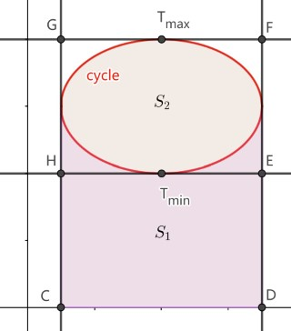

---  
tags:  
  - physics  
  - thermodynamics  
lev: 4  
categories:  
  - University Physics  
  - Thermodynamics  
share: true  
---  
  
# Table of Contents  
  
- [[Entropy#Background|Background]]  
- [[Entropy#Definition|Definition]]  
- [[Entropy#Irreversibility|Irreversibility]]  
- [[Entropy#Entropy of ideal gas|Entropy of ideal gas]]  
- [[Entropy#Entropy of isolated system|Entropy of isolated system]]  
- [[Entropy#Entropy and 2nd law|Entropy and 2nd law]]  
- [[Entropy#Engine and entropy|Engine and entropy]]  
	- [[Entropy#Engine and entropy|Reversible case]]  
		- [[Entropy#Reversible case|First step]]  
		- [[Entropy#Reversible case|Second step]]  
		- [[Entropy#Reversible case|Third step]]  
	- [[Entropy#Engine and entropy|Irreversibility]]  
  
# Entropy  
  
## Background  
  
In Carnot cycle, considering the sign of $Q$, we know that:  
  
$$\frac{Q_c}{T_c}+\frac{Q_h}{T_h}=0.$$  
  
In fact, consider a 'grid' formed by isothermal lines $pV=Const$ and adiabatic lines $pV^\gamma=Const$. For any closed route, we should have:  
  
$$\sum\frac{Q_i}{T_i}=0,$$  
  
where $Q_i$ is the heat flow of the $i$-th isothermal segment, and $T_i$ is the temperature of it.  
  
Now consider the line integral of differential form $\frac{dQ}{T}$ along certain path:  
  
- If we integrate along adiabatic curve $pV^\gamma=Const$, since $dQ\equiv0$, the integral is always $0$.   
- If we integrate along isothermal curve $pV=Const$, since $T$ is fixed, $\int\frac{dQ}{T}=\frac{1}{T}\int dQ=\frac{Q}{T}$.  
  
So if we choose the path to be a loop $C$ formed by this two curve, we would get:  
  
$$\displaystyle\underset{C}{\oint} \frac{dQ}{T}=\displaystyle \sum\frac{Q_i}{T_i}=0.$$  
  
This is not hard to understand. Now let's consider arbitrary closed curve. Let's change coordinate with:  
  
$$\begin{cases}u &=pV,\\v &=pV^\gamma,\end{cases}$$  
  
then the differential form $\frac{dQ}{T}$ would now be $w=F(u,v)du+G(u,v)dv$. In this new coordinate:  
  
- When $v$ is fixed (adiabatic), integration would always be $0$, that is  
  
  $$\int F(u,v_0)du=0$, $\forall v_0$$,  
  
  thus $F\equiv0$, $w=G(u,v)dv$.  
  
- Integration along any rectangle is $0$, using whatever arguments you like, whether *Green's theorem* or simple construction, you will find that $G(u,v)$ is independent of $u$. That is, $G(u,v)=h(v)$.  
  
Thus in the new coordinate, $\frac{dQ}{T}$ is a *perfect differential form*, which means that it's also a perfect differential form in the old coordinate. Thus along any closed curve:  
  
> $$\oint \frac{dQ}{T}=0.$$  
  
This result is called ***Clausius' theorem***.   
  
Actually, you can verify the result by another way. We have:  
  
$dU=dQ-dW$,  
  
thus,  
  
$$\frac{dQ}{T}=\frac{dU}{T}+\frac{pdV}{T}=\frac{C_V}{T}dT+\frac{nR}{V}dV=d(C_V\ln T+nR\ln V).$$  
  
It's indeed a perfect differential form.  
  
## Definition  
  
Here we give the definition of ***entropy***, $S$ :  
  
> $$dS=\frac{dQ_{rev}}{T}.$$  
  
Note that this definition is confined to $Q_{rev}$, because only reversible processes correspond to curves on $p$-$V$ diagram.  
  
This definition is based on the result that $\frac{dQ_{rev}}{T}$ is a perfect differential form, thus $S$ is a state function, just like $U$.  
  
## Irreversibility  
  
In irreversible process, according to our discussion in lifesaver 2, there are always $W_{irrev}<W_{rev}$, thus we know that $dQ_{irrev}<dQ_{rev}$. If there's any irreversibility in a cycle, we would have:  
  
$$\underset{C}{\oint} \frac{dQ}{T}=\int_{C_{rev}}\frac{dQ_{rev}}{T}+\int_{C_{irrev}}\frac{dQ_{irrev}}{T}<\underset{C}{\oint} \frac{dQ_{rev}}{T}=0.$$  
  
Thus combine with the equation, we will obtain an inequation:  
  
> $$\displaystyle \oint \frac{dQ}{T}\leq0.$$  
  
This is called ***Clausius' inequality***. This is true for any cycle.  
  
Note that for irreversible processes, $\Delta S\ne \int\frac{dQ}{T}$. In fact, for irreversible processes  
  
$$\Delta S=\int\frac{dQ_{rev}}{T}>\int\frac{dQ_{irrev}}{T}$$  
  
Combine this with equation, we obtain an inequation:  
  
$$\Delta S\geq\int\frac{dQ}{T}.$$  
  
(Keep in mind that $S$ is a state function, so $\Delta S$ only depends on the initial state and the terminal state.)  
  
*You may argue that in irreversible processes the temperature is not defined. I don't quite understand this, either. I have not seen any discussion on this so far. All materials I have seen discussing irreversibility seem to be blind to the issue.*  
  
## Entropy of ideal gas  
  
We actually already acquired the method of calculating entropy change above:  
  
$$dS=\frac{dQ}{T}=\frac{C_V}{T}dT+\frac{nR}{V}dV,$$,  
$  
thus:  
  
$$\Delta S=\int_{T_1}^{T_2}\frac{C_V}{T}dT+\int_{V_1}^{V_2}\frac{nR}{V}dV=C_V\ln\frac{T_2}{T_1}+nR\ln\frac{V_2}{V_1}.$$  
  
## Entropy of isolated system  
  
You may have heard this statement:  
  
> The entropy of an isolated system never decreases.  
  
Now we are able to demonstrate this statement. First, what is an *isolated system* ? Recall our definition in lifesaver 1:  
  
> A thermally-isolated system is a system not in thermal contact with its surroundings.  
  
We now know that this definition is basically saying $Q\equiv0$, which means:  
  
$$\displaystyle\Delta S\geq\int\frac{dQ}{T}=0.$$  
  
If the process is reversible, then:  
  
$$\displaystyle\Delta S=\int\frac{dQ}{T}=0.$$  
  
Also, if there's some irreversibility, then:  
  
$$\displaystyle\Delta S>\int\frac{dQ}{T}=0.$$  
  
That means, *spontaneous processes in an isolated system increases the system's entropy*.  
  
## Entropy and 2nd law  
  
The lengthy description of 2nd might have scared you. But you may have heard that the 2nd law of thermodynamics can also be described by entropy. This is indeed true, now we can derive that a perfect engine does not exist.  
  
Assume that a perfect engine exists, the effect of it is absorbing heat from one reservoir and turning it into work.   
  
When the engine has gone through one loop, the engine itself will return to the initial state, which means $\Delta S_{en}=0$. But heat are taken from the only reservoir. There will be $dQ<0$, so $\Delta S_{res}=\int\frac{dQ}{T}<0$, which means $\Delta S_{tot}<0$.   
  
The engine only does work to the environment, there's no other change, so it's isolated (think about it). Wow, we now have an isolated system with entropy decreasing! It's impossible! So such engine doesn't exist.  
  
Therefore, entropy is a more intrinsic description of the 2nd law.  
  
## Engine and entropy  
  
Recall that we asserted that the Carnot engine is the most efficient engine in [[./Heat Engines#Importance of Carnot cycle|Heat Engines > Importance of Carnot cycle]]. Now we can prove this assertion with entropy.  
  
First, we prove that efficiency of any reversible cycle is less than that of a similar Carnot cycle.  
  
### Reversible case  
  
We prove this in three steps:  
  
1. Convert $p$-$V$ diagram to $T$-$S$ diagram.  
2. Find $dQ$ and $dW$ in the new coordinate, and find $W$ and $Q_{in}$.  
3. Show that for any curve $\eta<1-\frac{T_{min}}{T_{max}}=\eta_C$.  
  
#### First step  
  
We have already done first step actually. What is a $T$-$S$ diagram? Recall that:  
  
$$dS=d(C_V\ln T+nR\ln V).$$  
  
Then:  
  
$$\begin{aligned}S&=C_V\ln T+nR\ln V+C\\ &=C_V(\ln T+\frac{nR}{C_V}\ln V)+C\\ &=C_V(\ln T+\frac{C_p-C_V}{C_V}\ln V)+C\\ &=C_V\ln TV^{\gamma-1}+C\\ &=C_V\ln\frac{PV^\gamma}{nR}+C\\ &=C_V\ln PV^\gamma +C.\end{aligned}$$  
  
Also with $T=\frac{PV}{nR}$, it's actually the same with the change of coordinate in the beginning of this note.  
  
You can prove that a closed cycle in $p$-$V$ diagram is equivalent to a closed cycle in $T$-$S$ diagram. Also, engines in $p$-$V$ diagram all run clockwise. It's easy to know that they run clockwise in $T$-$S$ diagram, too.  
  
#### Second step  
  
Now we are calculating $Q_{in}$ and $W$ of a closed cycle in $T$-$S$ diagram. First consider writing $dQ$ and $dW$:  
  
- $dQ=TdS$.  
- $dW=dQ-dU=TdS-C_VdT$.  
  
Then:  
  
- What is $Q_{in}$? We need to find all segments $A_i$ in the cycle such that $dQ=TdS>0$. Since $T$ is always positive, $dQ>0$ if and only if $dS>0$, that is, the segment is going right. Also, $\int TdS$ is actually area under curve, you can imagine yourself what $Q_{in}$ is.  
- What is $W$? We integrate $TdS-C_VdT$ over the loop. $C_VdT$ is a perfect differential (even if $C_V$ is a function of $T$ !), so it would yield $0$, what is $\oint TdS$? It's the area surrounded by the curve (why?).  
  
Also consider the highest segment of the curve, it must be going right (why?). So $Q_{in}$ is at least the area under the highest segment of the curve.  
  
  
  
#### Third step  
  
For any cycle, $Q_{in}\geq S_1+S_2$, and $W=S_2$. We have:  
  
$$\eta=\frac{W}{Q_{in}}\leq\frac{S_2}{S_1+S_2}=1-\frac{S_1}{S_1+S_2}\leq 1-\frac{S_{CDEH}}{S_{CDFG}}=1-\frac{T_{min}}{T_{max}}=\eta_C.$$  
  
You can also derive this just using integral. But anyway, we arrived at the conclusion that the efficiency of any reversible cycle is less that that of a similar Carnot cycle (Carnot cycle running between $T_{max}$ and $T_{min}$).  
  
### Irreversibility  
  
If there are any irreversibility in the cycle, assume that we put in the same $Q_{in}$, then the engine will not return to the initial state, otherwise $\Delta S=0$, it's reversible. Thus, $\Delta S>0$, if we want the engine to return to initial state, we need to pay extra entropy, that is, dump more heat into the environment (why?). Thus with the same $Q_{in}$, now $|Q_{out}|$ increases. We must have:  
  
$$\eta_{irrev}=1-\frac{|Q_{out}|}{Q_{in}}<\eta_{rev}$$  
  
---  
[[./index#Postscript|Postscript]]  
