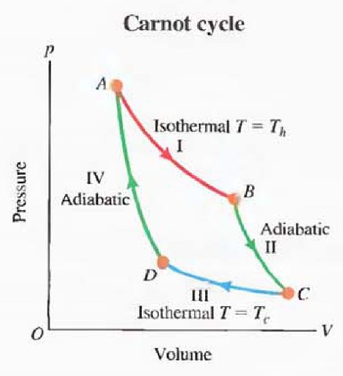
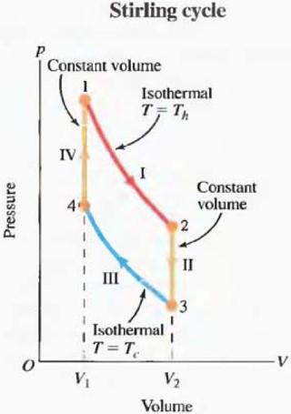
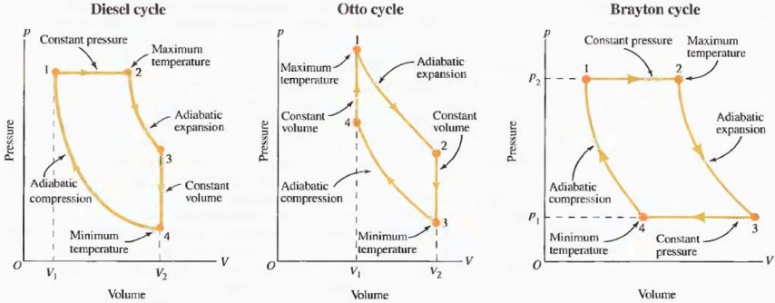

---  
tags:  
  - physics  
  - thermodynamics  
lev: 4  
categories:  
  - University Physics  
  - Thermodynamics  
share: true  
---  
  
# Table of Contents  
  
- [[Heat Engines#Engine|Engine]]  
	- [[Heat Engines#Engine|Definition]]  
	- [[Heat Engines#Engine|Features of an engine:]]  
	- [[Heat Engines#Engine|Efficiency]]  
- [[Heat Engines#Refrigerator and heat pump|Refrigerator and heat pump]]  
	- [[Heat Engines#Refrigerator and heat pump|Definition]]  
	- [[Heat Engines#Refrigerator and heat pump|Features]]  
- [[Heat Engines#Examples of heat engines|Examples of heat engines]]  
	- [[Heat Engines#Examples of heat engines|Carnot cycle]]  
		- [[Heat Engines#Carnot cycle|Analysis]]  
		- [[Heat Engines#Carnot cycle|Importance of Carnot cycle]]  
	- [[Heat Engines#Examples of heat engines|Stirling cycle:]]  
		- [[Heat Engines#Stirling cycle:|Analysis]]  
	- [[Heat Engines#Examples of heat engines|Other engines:]]  
	- [[Heat Engines#Examples of heat engines|Heat pumps and refrigerators]]  
  
# Heat Engines  
  
## Engine  
  
### Definition  
  
An ***engine*** is a device that transforms thermal energy into mechanical energy.   
  
### Features of an engine:  
  
1. works in cycles. Engines operate and perform work in closed cycles. Then  
  
   $$\Delta U=Q-W=0$$  
.  
  
2. includes more than one thermal reservoir. With only one temperature, area enclosed is zero, thus $W=0$.  
  
### Efficiency  
  
The efficiency of an engine is defined as:  
  
$$\eta=\frac{W}{Q_h},$$  
  
where $W$ is the work done in one cycle, $Q_h$ is the total positive heat flow supplied by the  
burning fuel.  
  
## Refrigerator and heat pump  
  
### Definition  
  
- A ***refrigerator*** removes heat from a colder reservoir, thus makes it even colder.  
  
- A ***heat pump*** heats a house by taking thermal energy from a colder reservoir (cool ground below the house) and dumping this thermal energy into the house at a higher temperature.  
  
### Features  
  
- Graph: counter-clockwise cycle on a $p$-$V$ diagram.  
  
- Work is done on the system.  
  
## Examples of heat engines  
  
### Carnot cycle  
  
The Carnot cycle consists of four legs:  
  
  
  
#### Analysis  
  
Heat flow only comes from isothermal processes:  
  
- Step $\text{I}$ : $Q_h=W_{AB}$.  
- Step $\text{III}$ : $|Q_c|=-W_{CD}$, $W_{CD}<0$, $Q_c$ is made positive for convenience.  
  
$W_{AB}$ and $W_{CD}$ is easy to get:  
  
$$  
W_{AB}=\int_{V_A}^{V_B}pdV=\int_{V_A}^{V_B}\frac{nRT_h}{V}dV=nRT_h\ln\frac{V_B}{V_A}$$.  
  
$$  
W_{CD}=\int_{V_C}^{V_D}pdV=\int_{V_C}^{V_D}\frac{nRT_c}{V}dV=nRT_c\ln\frac{V_D}{V_C}<0$$.  
  
This is a cycle, we have $W=Q=Q_h-|Q_c|$, so:  
  
$$\eta=\frac{W}{Q_h}=\frac{Q_h-|Q_c|}{Q_h}=1-\frac{|Q_c|}{Q_h}.$$  
  
Also, we can express $\frac{V_D}{V_C}$ in terms of $\frac{V_B}{V_A}$:  
  
$$\frac{V_D}{V_C}=\left((\frac{V_D}{V_C})^\gamma\right)^\frac{1}{\gamma}=\left(\frac{\frac{p_AV_A^\gamma}{p_D}}{\frac{p_BV_B^\gamma}{p_C}}\right)^\frac{1}{\gamma}=\left(\frac{p_AV_A^\gamma p_C}{p_BV_B^\gamma p_D}\right)^\frac{1}{\gamma}=\left(\frac{V_A^{\gamma-1} V_D}{V_B^{\gamma-1} V_C}\right)^\frac{1}{\gamma},$$  
  
thus $\displaystyle \left(\frac{V_D}{V_C}\right)^{\gamma-1}=\left(\frac{V_A}{V_B}\right)^{\gamma-1}$, that is $\displaystyle \frac{V_D}{V_C}=\frac{V_A}{V_B}$.  
  
So:  
  
$$\eta=1-\frac{|Q_c|}{Q_h}=1+\frac{nRT_c\ln\frac{V_D}{V_C}}{nRT_h\ln\frac{V_B}{V_A}}=1-\frac{T_c}{T_h}.$$  
  
This means the efficiency of a Carnot cycle only depends on the temperatures of the two thermal reservoirs.  
  
#### Importance of Carnot cycle  
  
The derivation for efficiency above only applies to ideal gas. But the importance of Carnot cycle lies beyond that. In fact, we can prove that:  
  
> 1. *All Carnot cycles that operate between any two given temperatures have the same efficiency.*  
> 2. *The Carnot engine is the most efficient engine possible that operates between two given temperatures.*  
  
- The first statement **not just** includes the ideal gas case.   
- The second statement will be demonstrated in [[./Entropy#Engine and entropy|Entropy > Engine and entropy]] section.  
  
***proof for 1st statement***  
  
Let's say, that there are two Carnot engines $A$ and $B$ between $T_h$ and $T_c$ that have different efficiencies $\eta_A$ and $\eta_B$, and $\eta_A>\eta_B$. By adjusting the amount of gas in the two engines we can ensure that $Q_{h,A}=Q_{h,B}=Q_h$. Consider combining:  
  
1. Engine $A$ : Get $Q_{h}$ heat from hot reservoir, release $(1-\eta_A)Q_h$ heat into cold reservoir, and does $\eta_AQ_h$ work;  
2. The reverse of engine $B$ : Put into $\eta_BQ_h$ work, extract $(1-\eta_B)Q_h$ heat from cold reservoir, and release $Q_h$ heat into hot reservoir.  
  
The result is purely converting $(\eta_A-\eta_B)Q_h$ heat from the cold reservoir into $(\eta_A-\eta_B)Q_h$ work, which is against Kelvin's statement of 2nd law, so we must have $\eta_A=\eta_B$.  
  
This tells us that whether the work gas is ideal or not, the efficiency of Carnot engine between $T_h$ and $T_c$ is:  
  
$$\displaystyle \eta=1-\frac{T_c}{T_h}.$$  
  
>[!INFO]  
>The rest are all examples. For new knowledge you can advance to [[./The 2nd Law of Thermodynamics|The 2nd Law of Thermodynamics]] and [[./Entropy|Entropy]].  
  
### Stirling cycle:  
  
The Stirling cycle also consists of 4 legs, but a little bit different.  
  
   
  
#### Analysis  
  
The only legs that do work are $\text{I}$ and $\text{III}$, thus:  
  
$$W=W_{\text{I}}+W_{\text{III}}=nRT_h\ln\left(\frac{V_2}{V_1}\right)+nRT_c\ln\left(\frac{V_1}{V_2}\right)=nR(T_h-T_c)\ln\left(\frac{V_2}{V_1}\right)$$  
  
The legs that absorb heat are $\text{I}$ and $\text{IV}$, thus:  
  
$$Q_{in}=Q_{\text{I}}+Q_{\text{IV}}=nRT_h\ln\left(\frac{V_2}{V_1}\right)+nc_{V,m}(T_h-T_c)$$  
  
So the efficiency is:  
  
$$\eta_S=\frac{W}{Q_{in}}=\frac{R(T_h-T_c)\ln(V_2/V_1)}{RT_h\ln(V_2/V_1)+c_{V,m}(T_h-T_c)}$$  
  
Obviously:  
  
$$\eta_S=\frac{R(T_h-T_c)\ln(V_2/V_1)}{RT_h\ln(V_2/V_1)+c_{V,m}(T_h-T_c)}<\frac{R(T_h-T_c)\ln(V_2/V_1)}{RT_h\ln(V_2/V_1)}=\frac{T_h-T_c}{T_h}=\eta_C$$  
  
So the efficiency of the Stirling cycle is less than that of the Carnot cycle.  
  
*In some cases there is a regenerator that transfer the heat released in $\text{II}$ to process $\text{IV}$, thus the efficiency would be just $\eta_C$.*  
  
### Other engines:  
  
Any closed curve on $p$-$V$ diagram represents an engine. Here are examples of some other engines.  
  
   
  
### Heat pumps and refrigerators  
  
Recall our definition of heat pumps and refrigerators above. They are actually engines that run in reverse. There must be something describing the efficiency of them. Here we define the coefficients of performance for them:  
  
- Heat pumps: $\displaystyle K_{hp}=\frac{Q_{rej}}{W}$, $Q_{rej}$ is the positive heat flow ejected into a hot thermal reservoir.  
- Refrigerators: $\displaystyle K_{ref}=\frac{Q_{abs}}{W}$, $Q_{abs}$ is the positive heat flow absorbed from cold thermal reservoir.  
  
The sign of work $W$ here is actually reversed. Keep in mind that we are doing work to the system.  
  
If we know the efficiency $\eta$ of the engine that runs in reverse, we can calculate the coefficients of performance:  
  
$$K_{hp}=\frac{Q_h}{W}=\frac{1}{\eta}\geq \frac{1}{\eta_C}.$$  
  
$$K_{ref}=\frac{|Q_c|}{W}=\frac{Q_h-W}{W}=\frac{1}{\eta}-1\geq\frac{1}{\eta_C}-1.$$  
  
---  
Ahead:  
- [[./The 2nd Law of Thermodynamics|The 2nd Law of Thermodynamics]]  
- [[./Entropy|Entropy]]