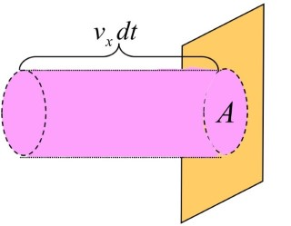
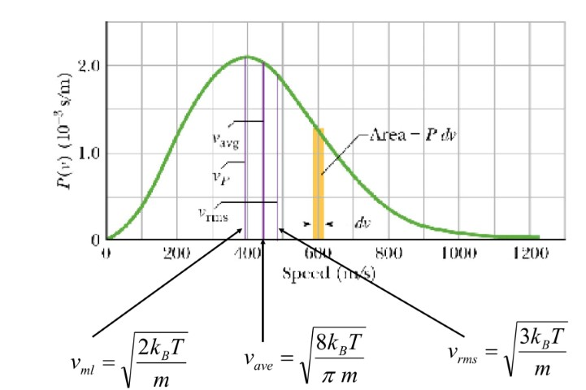

---  
tags:  
  - physics  
  - thermodynamics  
  - statistical_mechanics  
lev: 4  
share: true  
categories:  
  - University Physics  
  - Thermodynamics  
---  
  
# Table of Contents  
  
- [[Statistical Mechanics#Basic assumptions|Basic assumptions]]  
- [[Statistical Mechanics#Pressure and molecule motion|Pressure and molecule motion]]  
	- [[Statistical Mechanics#Pressure and molecule motion|Rms speed]]  
	- [[Statistical Mechanics#Pressure and molecule motion|Internal energy]]  
	- [[Statistical Mechanics#Pressure and molecule motion|Pressure]]  
- [[Statistical Mechanics#Temperature|Temperature]]  
- [[Statistical Mechanics#Velocity distribution of gases|Velocity distribution of gases]]  
- [[Statistical Mechanics#Distribution of velocity|Distribution of velocity]]  
- [[Statistical Mechanics#Distribution of speed|Distribution of speed]]  
- [[Statistical Mechanics#Maxwell-Boltzmann distribution|Maxwell-Boltzmann distribution]]  
	- [[Statistical Mechanics#Maxwell-Boltzmann distribution|The distribution]]  
	- [[Statistical Mechanics#Maxwell-Boltzmann distribution|Equipartition]]  
  
  
# Statistical Mechanics  
  
## Basic assumptions  
  
1. A gas consists of a very large number of molecules that make elastic collisions (of negligible time duration) with each other and with the walls of the container.  
2. The molecules are separated by distances that are large compared to their diameters, and they exert no forces on each other except when they collide.  
3. In the absence of external forces, there is no preferred direction for a molecule in the container, and there is no preferred direction for its velocity vector.  
  
## Pressure and molecule motion  
  
### Rms speed  
  
Since there's no preferred direction for velocity, we know the average velocity is zero:  
  
$$\langle \vec{v}\rangle=\langle v_x\rangle=\langle v_y\rangle=\langle v_z\rangle=0$$  
  
But average speed and the average of speed squared is not zero. $\sqrt{\langle v^2\rangle}$ is called ***root-mean-square (rms) speed***. Note that average speed $\langle v\rangle$ is different from rms speed, because taking average and square root don't commute.  
  
Also, since there's no preferred direction and $v^2=v_x^2+v_y^2+v_z^2$, we know:  
  
$$\langle v_x^2\rangle=\langle v_y^2\rangle=\langle v_z^2\rangle=\frac{1}{3}\langle v^2\rangle$$  
  
### Internal energy  
  
For monatomic molecules, we can assert that the internal energy entirely comes from molecules' kinetic energy, which means:  
  
$$U=N\langle K\rangle=N\cdot \frac{1}{2}m\langle v^2\rangle.$$  
  
### Pressure  
  
Imagine a wall parallel to $yz$ plane. In a short time $dt$, consider all molecules with $x$-component of velocity of  $v_x$ in a cylinder like this:  
  
  
  
There are molecules with $v_x$ moving out of the cylinder and into it during $dt$, we can actually assume that the number of molecules moving out of the cylinder equals the number of molecules moving into it. The result is the same that all molecules with $x$-component of velocity of  $v_x$ and moving to the right are going to strike the wall in an area $A$ in $dt$.  
  
Actually only half of the molecules with $v_x$ is going to hit the wall, since another half are going left. What's the number density $\rho_x$ of molecules with $x$-component of velocity of  $v_x$?   
  
Assume that in all molecules, a molecule has probability density $f(v_x)$ to have $x$-component of velocity of  $v_x$. Then   
  
$$\rho_x=f(v_x)\bar{\rho}=\frac{f(v_x)N}{V}.$$  
  
Then during $dt$, the number of collisions between molecules with $x$-component of velocity of  $v_x$ and an area $A$ of the wall is given by:   
  
$$\frac{1}{2}\rho_x(v_xdt)A=\frac{f(v_x)N}{2V}v_xAdt.$$  
  
We are assuming elastic collision with the wall, the total momentum transferred by the molecular collisions in time $dt$ is  
  
$$dp_{v_x}=(2mv_x)\frac{f(v_x)N}{2V}v_xAdt=mv_x^2f(v_x)\frac{N}{V}Adt.$$  
  
This yields a force  
  
$$F_{v_x}=\frac{dp_x}{dt}=mv_x^2f(v_x)\frac{N}{V}A,$$  
  
and a pressure on the wall:  
  
$$P_{v_x}=\frac{F_x}{A}=mv_x^2f(v_x)\frac{N}{V}$$  
  
To get the total pressure, we need to sum over all $P_{v_x}$, which means integral:  
  
 $$\int mv_x^2f(v_x)\frac{N}{V}dv_x$$  
  
What is $\displaystyle\int v_x^2f(v_x)dv_x$ ? It's just $\langle v_x^2\rangle$! So $P=m\frac{N}{V}\langle v_x^2\rangle$. We also have $U=N\cdot \frac{1}{2}m\langle v^2\rangle=\frac{3}{2}mN\langle v_x^2\rangle$. Therefore we get a beautiful equation:  
  
> $$PV=\frac{2}{3}U.$$  
  
## Temperature  
  
The textbook here just relate the ideal gas law $PV=nRT=Nk_BT$ with $PV=\frac{2}{3}U$ here to yield:  
  
$$k_BT=\frac{2U}{3N}=\frac{2}{3}\langle K\rangle.$$  
  
*The temperature of an ideal gas is a measure of the average kinetic energy of the constituents.*  
  
## Velocity distribution of gases  
  
The textbook doesn't give the derivation of Maxwell's distribution. But it can be derived just using existing knowledge. The following proof is inspired by a passage ([link](https://zhuanlan.zhihu.com/p/614405721)) on Zhihu.  
  
## Distribution of velocity  
  
What we want to do is finding a probability density function $F(\vec{v})$ for velocity vector $\vec{v}$. It is a function on $\mathbb{R}^3$, and can be also written as $F(v_x,v_y,v_z)$.  
  
We defined a probability density function $f(v_x)$ for $x$-component of velocity in last section. We know that due to symmetry that would also work for $y$ and $z$-component. And they are independent, so we can say that:  
  
$$F(v_x,v_y,v_z)=f(v_x)f(v_y)f(v_z)$$  
  
There's no preferred direction for velocity, thus all $\vec{v}$ with equal magnitudes share the same value of $F(\vec{v})$. So $F$ can be described by a function of $|\vec{v}|$. For convenience, $F$ can be described by a function of $v^2=|\vec{v}|^2$. That is:  
  
$$\exists G,\;s.t.\;F(\vec{v})=G(v^2).$$  
  
It's the same with three components:  
  
$$\exists g,\;s.t.\; f(v_i)=g(v_i^2),\;for\;i=x,y,z.$$  
  
Now we get:  
  
$$G(v^2)=G(v_x^2+v_y^2+v_z^2)=g(v_x^2)g(v_y^2)g(v_z^2).$$  
  
Take logarithm:  
  
$$\ln G(v^2)=\ln G(v_x^2+v_y^2+v_z^2)=\ln g(v_x^2)+\ln g(v_y^2)+\ln g(v_z^2)$$  
  
For convenience, set $s=v^2$and $s_i=v_i^2$, set $H(x)=\ln G(x)$, $h(x)=\ln g(x)$, then:  
  
$$H(s)=H(s_x+s_y+s_z)=h(s_x)+h(s_y)+h(s_z).$$  
  
Set $s_x=s_y=s_z=s_0$,  
  
$$H(3s_0)=3h(s_0)\implies h(x)=\frac{1}{3}H(3x).$$  
  
which means:  
  
$$H(s_x+s_y+s_z)=\frac{1}{3}(H(3s_x)+H(3s_y)+H(3s_z)).$$  
  
Of course we assume that at least $H\in \mathscr{C}^1[0,+\infty)$ (Actually we can suppose that it's smooth). Due to a series of conclusions in calculus on convexity, $H$ can only be a linear function, so is $h$, and:  
  
$$f(v_x)=g(v_x^2)=\exp\{h(s_x)\}=e^{as_x+b}=e^{av_x^2+b}.$$  
  
And $f$ must satisfies:  
  
- $\displaystyle\int_{-\infty}^{\infty} f(v_x)dv_x$ exists and equals to $1$.  
- $\displaystyle\int_{-\infty}^{\infty} v_x^2f(v_x)dv_x=\langle v_x^2\rangle=\frac{k_BT}{m}$.  
  
The former yields $a<0$ and $e^b=\sqrt{\frac{-a}{\pi}}$, the latter yields $a=\frac{m}{2k_BT}$, so:  
  
> $$f(v_x)=\sqrt{\frac{m}{2\pi k_BT}}e^{-\frac{mv_x^2}{2k_BT}}.$$  
  
Moreover:  
  
> $$F(\vec{v})=\left(\frac{m}{2\pi k_BT}\right)^\frac{3}{2}e^{-\frac{mv^2}{2k_BT}}.$$  
  
This is exactly what we see on textbooks.  
  
*Unfortunately, to be rigorous, we actually can't directly go to $T$ here, since the formal definition of $T$ hasn't been given. Also, our former discussion are restricted to monatomic gas.*  
  
## Distribution of speed  
  
Be alert that the equation above is the **velocity** distribution. The **speed** distribution $F_s$ will be slightly different, since we are not distinguishing directions now.  
  
Imagine a sphere of radius $v_0$ in $\mathbb{R}^3$. Each dot on the surface of the sphere corresponds to a velocity vector $\vec{v}$ with magnitude $v_0$. They all have the same probability density $G(v_0^2)$. To get the probability density of speed at $v=v_0$, we need to integrate $G(v_0)$ over the sphere. $G(v_0^2)$ is a constant, so we would get $G(v_0^2)S_{sphere}=4\pi v_0^2G(v_0^2)$, this gives:  
  
> $$F_s(v)=4\pi v^2\left(\frac{m}{2\pi k_BT}\right)^\frac{3}{2}e^{-\frac{mv^2}{2k_BT}}.$$  
  
This is called Maxwellian distribution. We can calculate:  
  
- Highest point: set derivative to zero, ***most likely speed*,** $\displaystyle v_{ml}=\sqrt{\frac{2k_BT}{m}}$,  
- Average: ***average speed*,** $\displaystyle v_{ave}=\int_0^\infty vF_s(v)dv=\sqrt{\frac{8k_BT}{\pi m}}$.  
  
Compare with   
  
- RMS speed: ***root mean square speed***, $\displaystyle v_{rms}=\sqrt{\frac{3k_BT}{m}}$.  
  
We have a picture:  
  
  
  
## Maxwell-Boltzmann distribution  
  
### The distribution  
  
The discussion before only works for monatomic gas, because for molecules with more atoms, the total energy does not purely come from kinetic energy of translation. There may be rotation, and there may be oscillation. But anyway, as long as we suppose them to be independent and *the states with the same total energy are equally likely*, we can apply our arguments above.   
  
Boltzmann got this equation:  
  
> $$F=\frac{1}{Z}e^{-\frac{E}{k_BT}}.$$  
  
Here $E$ is total energy, $Z$ is constant that takes into account the normalization. Actually we can do most of its derivation, but what we can't explain is that why the average energy of every term is exactly $\frac{1}{2}k_BT$. Here comes the equipartition:  
  
### Equipartition  
  
Every term in the energy expression that is quadratic in an independent dynamical variable designates a ***degree of freedom***.  
  
Generally, *the contribution of each degree of freedom to the average energy of a molecule is $\frac{1}{2}k_BT$*. This is called ***equipartition theorem***.  
  
Set $s$ to be the degree of freedom, then:  
  
> $$\langle E\rangle=\frac{s}{2}k_BT.$$  
  
---  
Ahead:  
- [[./Heat Engines|Heat Engines]]