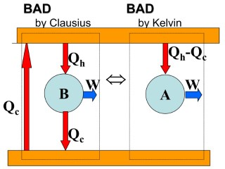
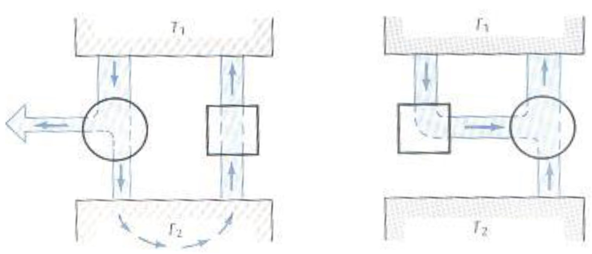

---  
tags:  
  - physics  
  - thermodynamics  
lev: 4  
categories:  
  - University Physics  
  - Thermodynamics  
share: "true"  
---  
  
  
# Table of Contents  
  
- [[The 2nd Law of Thermodynamics#Kelvin formulation:|Kelvin formulation:]]  
	- [[The 2nd Law of Thermodynamics#Kelvin formulation:|Statement]]  
	- [[The 2nd Law of Thermodynamics#Kelvin formulation:|Notes]]  
- [[The 2nd Law of Thermodynamics#Clausius formulation:|Clausius formulation:]]  
	- [[The 2nd Law of Thermodynamics#Clausius formulation:|Statement]]  
	- [[The 2nd Law of Thermodynamics#Clausius formulation:|Notes]]  
- [[The 2nd Law of Thermodynamics#Equivalence between two statements|Equivalence between two statements]]  
  
  
# The 2nd Law of Thermodynamics  
  
## Kelvin formulation:   
  
### Statement  
  
> It is impossible to construct a cyclic engine whose only effect is to convert thermal energy from a body at a given temperature into an equivalent amount of mechanical work. (No perfect engine)  
  
### Notes  
  
This description directly denied the existence of a machine that extracts thermal energy from the ocean and convert it into work without further effect, such as heating a lower temperature surrounding.  
  
*However, it's possible for non-cyclic engine to convert 100% of the thermal energy into work, but this does not really fit the definition of an' engine’  given by the course--- it is sort of an oxymoron.*  
  
## Clausius formulation:  
  
### Statement  
  
> It is impossible to construct a cyclic engine whose only effect is to transfer thermal energy  
> from a colder body to a hotter body. (No perfect refrigerator)  
  
### Notes  
  
This description directly denied the existence of a machine that can freeze water and use the released energy to boil more water with no further effect.   
  
Here the 'further effect' means that the engine must use some energy from the surroundings.  
  
## Equivalence between two statements  
  
We can prove that the two statements are equivalent.  
  
- If there is a perfect *refrigerator*, then we can construct a perfect *engine*.  
- If there is a perfect *engine*, then we can construct a perfect *refrigerator*.  
  
  
  
If you combine a normal engine with a perfect refrigerator, you will get a perfect engine.  
  
Vice versa, if you combine a normal refrigerator with a prefect engine, you will get a perfect refrigerator.  
  
  
  
---  
Ahead:  
- [[./Entropy|Entropy]]